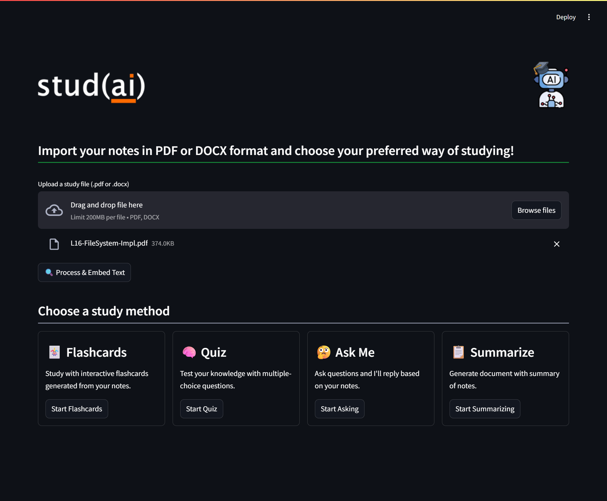

# 🧠 AI Study Mate - stud(ai)
**stud(ai)** is a Streamlit-based interactive study assistant powered by LangChain and LLMs. It helps students transform their study notes into flashcards, quizzes, and summaries — all from uploaded PDFs or DOCX files.

> ⚙️ Built as a learning project before my Summer 2025 internship as a Software Engineer at **CYENS Centre of Excellence** to gain hands-on experience with Streamlit and LangChain.


## 🚀 Features

- 📄 Upload `.pdf` or `.docx` study files
- 🧩 Automatic chunking and embedding of document content
- 🃏 **Flashcard Generator** – turns your notes into interactive flashcards
- 🧠 **Quiz Mode** *(coming soon)* – generate multiple choice questions
- 🤔 **Ask Me Anything** *(coming soon)* – ask context-aware questions
- 📋 **Summarize Notes** *(coming soon)* – generate concise summaries


## 🔧 Tech Stack

- **Frontend:** [Streamlit](https://streamlit.io/)
- **LLMs:** [OpenAI](https://openai.com/), [HuggingFace Hub](https://huggingface.co/)
- **LangChain:** document loaders, chains, vector store
- **Embeddings:** `all-MiniLM-L6-v2` via Sentence Transformers
- **Vector DB:** FAISS (local storage)


## 📸 Preview




## 📦 Installation

```bash
git clone https://github.com/yourusername/ai-study-mate
cd ai-study-mate
python -m venv venv
source venv/bin/activate  # or venv\Scripts\activate on Windows
pip install -r requirements.txt
````


## 🔐 Environment Variables

Create a `.env` file and add your API keys:

```env
OPENAI_API_KEY=your_openai_key
HUGGINGFACEHUB_API_TOKEN=your_huggingface_token
```


## 📜 License

This project is licensed under the **MIT License**.